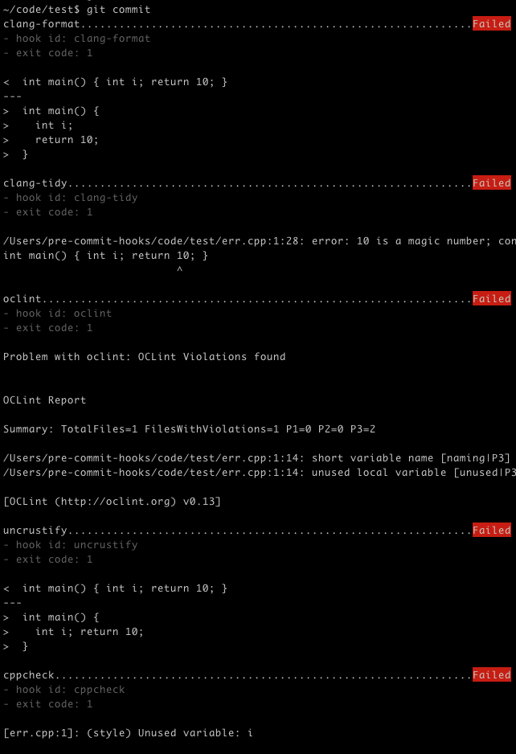

# pre-commit hooks

This is a [pre-commit](https://pre-commit.com) hooks repo that
integrates five C/C++ linters:
> [clang-format](https://clang.llvm.org/docs/ClangFormatStyleOptions.html),
[clang-tidy](https://clang.llvm.org/extra/clang-tidy/),
[oclint](http://oclint.org/),
[uncrustify](http://uncrustify.sourceforge.net/),
[cppcheck](http://cppcheck.sourceforge.net/)

Many of these linters will return 0 on error, which pre-commit will then
mark as passing. Additionally, pre-commit has
[a bug](https://github.com/pre-commit/pre-commit/issues/1000)
where arguments after `--` are dropped. This repo's hooks for each command
will fail correctly and honor all `--` arguments.

This repo is available in both python and bash. To use a language, use `rev: $lang`
in your `.pre-commit-config.yaml`. Master is set to python as the default as it is
easier to maintain and troubleshoot.

## Example Usage

With `int main() { int i; return 10; }` in a file `err.cpp`, all five linters should fail on commit:

<p align="center">
  
</p>

Using clang-format `8.0.0`; clang-tidy `8.0.0`; oclint `0.13`

The above uses this `.pre-commit-config.yaml`:

```yaml
fail_fast: false
repos:
  - repo: https://github.com/pocc/pre-commit-hooks
    rev: python
    hooks:
      - id: clang-format
        args: [--style=Google]
      - id: clang-tidy
        args: [-checks=*, -warnings-as-errors=*]
      - id: oclint
        args: [-enable-clang-static-analyzer, -enable-global-analysis]
      - id: uncrustify
      - id: cppcheck
        args: [--enable=all]
```

_Note that for your config yaml, you can supply your own args or remove the args line entirely,
depending on your use case._

## Using the Hooks

Python3.6+ is required to use these hooks as all 5 invoking scripts are written in it.
As this is also the minimum version of pre-commit, this should not be an issue.

### Installation

_You will need to install these utilities in order to use them. Your package
manager may already have them. Below are the package names for each package manager, if available:_

- `apt install clang clang-format clang-tidy uncrustify cppcheck` [1] [2]
- `yum install llvm uncrustify cppcheck` [2]
- `brew install llvm oclint uncrustify cppcheck` [3]
- `choco install llvm uncrustify cppcheck` [4]

[1]: `clang` is a required install for `clang-format` or `clang-tidy` to work.

[2]: oclint takes a couple hours to compile. I've compiled and tarred
[oclint-v0.15](https://dl.dropboxusercontent.com/s/nu474emafxj2nn5/oclint.tar.gz)
for those using linux who want to skip the wait (built on Ubuntu-18.04).
You can also download the older [oclint-v0.13.1](https://github.com/oclint/oclint/releases/download/v0.13.1/oclint-0.13.1-x86_64-linux-4.4.0-112-generic.tar.gz)
for linux from oclint's github page (see [releases](https://github.com/oclint/oclint/releases)).

[3]: Depending on your brew installation, you may need to install
oclint with `brew cask install oclint`.

[4]: oclint is not available on windows.

If your package manager is not listed here, it will have similar names for these tools.
You can build all of these from source.

### Hook Info

| Hook Info                                                                | Type                 | Languages                             |
| ------------------------------------------------------------------------ | -------------------- | ------------------------------------- |
| [clang-format](https://clang.llvm.org/docs/ClangFormatStyleOptions.html) | Formatter            | C, C++, ObjC                          |
| [clang-tidy](https://clang.llvm.org/extra/clang-tidy/)                   | Static code analyzer | C, C++, ObjC                          |
| [oclint](http://oclint.org/)                                             | Static code analyzer | C, C++, ObjC                          |
| [uncrustify](http://uncrustify.sourceforge.net/)                         | Formatter            | C, C++, C#, ObjC, D, Java, Pawn, VALA |
| [cppcheck](http://cppcheck.sourceforge.net/)                             | Static code analyzer | C, C++                                |

### Hoop Option Comparison

| Hook Options                                                             | Fix In Place | Enable all Checks                             | Set key/value |
| ------------------------------------------------------------------------ | ------------ | --------------------------------------------- | --------------- |
| [clang-format](https://clang.llvm.org/docs/ClangFormatStyleOptions.html) | `-i`         |                   | |
| [clang-tidy](https://clang.llvm.org/extra/clang-tidy/)                   | `--fix-errors` [1] | `-checks=*` `-warnings-as-errors=*` | |
| [oclint](http://oclint.org/)                                             |  | `-enable-global-analysis` `-enable-clang-static-analyzer` | `-rc=<key>=<value>` |
| [uncrustify](http://uncrustify.sourceforge.net/)                         | `--replace` `--no-backup` [2] |  | `--set key=value` |
| [cppcheck](http://cppcheck.sourceforge.net/)                             |  | `-enable=all` | |

[1]: `-fix` will fail if there are compiler errors. `-fix-errors` will `-fix`
and fix compiler errors if it can, like missing semicolons.

[2]: By definition, if you are using `pre-commit`, you are using version control.
Therefore, it is recommended to avoid needless backup creation by using `--no-backup`.

### Enforcing linter version with --version

Some linters change behavior between versions. To enforce a linter version
8.0.0, for example, add `--version=8.0.0` to `args:` for that linter. Note that
this is a pre-commit hook arg and will be filtered before args are passed to the linter.

### Compilation Database

`clang-tidy` and `oclint` both expect a
[compilation database](https://clang.llvm.org/docs/JSONCompilationDatabase.html).
Both of the hooks for them will ignore the error for not having one.

You can generate with one `cmake -DCMAKE_EXPORT_COMPILE_COMMANDS=ON ...` if you
have a cmake-based project.

### The '--' doubledash option

Options after `--` like `-std=c++11` will be interpreted correctly for
`clang-tidy` and `oclint`. Make sure they sequentially follow the `--` argument
in the hook's args list.

### Standalone Hooks

If you want to have predictable return codes for your C linters outside of pre-commit,
these hooks are available via [PyPI](https://pypi.org/project/CLinters/).
Install it with `pip install CLinters`.
They are named as `$cmd-hook`, so `clang-format` becomes `clang-format-hook`.

If you want to run the tests below, you will need to install them from PyPI
or locally with `pip install .`.

## Development

### Testing

To run the tests and verify `clang-format`, `clang-tidy`, and `oclint` are
working as expected on your system, use `pytest --runslow --internal -vvv`.
This will work on both bash and python branches.

Testing is done by using pytest to generate 76 table tests (python branch)
based on combinations of args, files, and expected results.

The default is to skip most (41/76) tests as to run them all takes ~60s. These
pytest options are available to add test types:

* `--runslow`: oclint tests, which take extra time
* `--internal`: Internal class tests to ensure internal/shell APIs match

**Note**: You can parallelize these tests with `pytest-xdist`. Adding `-n 32`
to the command creates 32 workers and divides runtime by ~6x in my testing.

To run all tests serially, run `pytest -x -vvv --internal --runslow` like so:

```bash
pre-commit-hooks$ pytest -x -vvv --internal --runslow
============================= test session starts ==============================
platform darwin -- Python 3.7.6, pytest-5.4.1, py-1.7.0, pluggy-0.13.1 -- /usr/local/opt/python/bin/python3.7
cachedir: .pytest_cache
rootdir: /Users/pre-commit-hooks/code/pre-commit-hooks, inifile: pytest.ini
collected 76 items

tests/test_hooks.py::TestHooks::test_run[run_cmd_class clang-format on /Users/pre-commit-hooks/code/pre-commit-hooks/tests/files/ok.c] PASSED [  3%]
tests/test_hooks.py::TestHooks::test_run[run_cmd_class clang-tidy on /Users/pre-commit-hooks/code/pre-commit-hooks/tests/files/ok.c] PASSED [  7%]
...

============================= 76 passed in 61.86s ==============================
```

### Why have a script when your hook could be `$command "$@"`?

shellcheck keeps things simple by relaying arguments as `shellcheck "$@"`.
This is not possible with several C/C++ linters because they exit 0 when
there are errors. pre-commit registers failures by non-zero exit codes,
which results in false "passes".

## Additional Resources

### clang-format

* [Official Docs](https://clang.llvm.org/docs/ClangFormatStyleOptions.html)
* [clang-format
  Guide](https://embeddedartistry.com/blog/2017/10/23/creating-and-enforcing-a-coding-standard-with-clang-format) -
  a good overview and a great place to get started
* [clang-format Configurator](https://zed0.co.uk/clang-format-configurator/) - Website to
  interactively design your config while
* [clang-format Options Explorer](https://clangformat.com/) - Website to interactively
  understand various options
* [Source Code](https://github.com/llvm-mirror/clang/tree/master/tools/clang-format)

### clang-tidy

* [Official Docs](https://clang.llvm.org/extra/clang-tidy/)
* [clang-tidy
  guide](https://www.kdab.com/clang-tidy-part-1-modernize-source-code-using-c11c14/) -
  Good place to start
* [Example
  usage](https://github.com/KratosMultiphysics/Kratos/wiki/How-to-use-Clang-Tidy-to-automatically-correct-code) -
  Explanation of how to use clang-tidy by the creators of Kratos
* [Add your own
  checks](https://devblogs.microsoft.com/cppblog/exploring-clang-tooling-part-1-extending-clang-tidy/) -
  Function names must be _awesome_!
* [Source Code](https://github.com/llvm-mirror/clang-tools-extra/tree/master/clang-tidy)

### oclint

* [Official Docs](http://oclint.org/)
* [Fastlane Integration](https://docs.fastlane.tools/actions/oclint/)
* [Source Code](https://github.com/oclint/oclint)

### uncrustify

* [Official Docs](http://uncrustify.sourceforge.net/)
* [Getting Started with Uncrustify](https://patrickhenson.com/2018/06/07/uncrustify-configuration.html)
* [Source Code](https://github.com/uncrustify/uncrustify)

### cppcheck

* [Official Docs](http://cppcheck.sourceforge.net/)
* [Using Cppcheck](https://katecpp.wordpress.com/2015/08/04/cppcheck/)
* [Source Code](https://github.com/danmar/cppcheck)

## License

Apache 2.0
